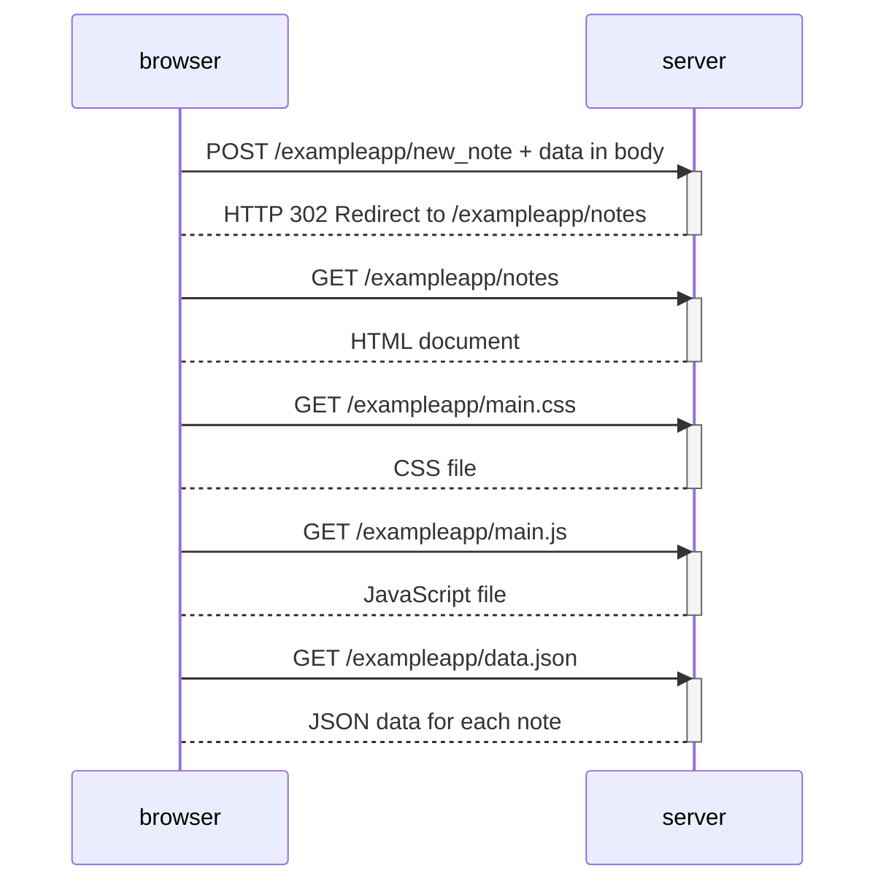

```mermaid
sequenceDiagram
    participant browser
    participant server

    browser->>server: POST /exampleapp/new_note + data in body
    activate server
    server-->browser: HTTP 302 Redirect to /exampleapp/notes
    deactivate server

    browser->>server: GET /exampleapp/notes
    activate server
    server-->browser: HTML document
    deactivate server

    browser->>server: GET /exampleapp/main.css
    activate server
    server-->browser: CSS file
    deactivate server

    browser->>server: GET /exampleapp/main.js
    activate server
    server-->browser: JavaScript file
    deactivate server

    browser->>server: GET /exampleapp/data.json
    activate server
    server-->browser: JSON data for each note
    deactivate server
```